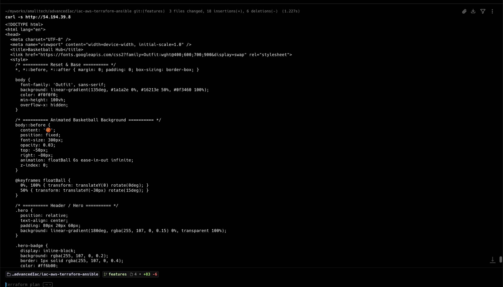

# IaC AWS Terraform + Ansible

## 1. Lab Objective
Provision a minimal, reproducible AWS EC2 web server using Terraform and configure it with Ansible to serve a static site through Nginx.

## 2. Problem Understanding
The lab requires a full infrastructure and configuration flow that:
- Provisions EC2, security groups, and SSH access.
- Generates a key pair and a consumable Ansible inventory.
- Configures the instance to install and run Nginx.
- Deploys a static HTML page.

Constraints and expectations:
- Use Terraform for infrastructure provisioning.
- Use Ansible for server configuration.
- Automate the full flow with a repeatable script.
- Capture logs for auditing and reproducibility.

## 3. Architecture Design
Components and interactions:

```
Developer
  |
  v
run-all.sh
  |
  v
Terraform
  |
  +--> AWS: VPC (default), SG, EC2, Key Pair
  |
  +--> Local: ansible/inventory.ini, ansible/<key>.pem
  |
  v
Ansible
  |
  v
EC2 Instance (Amazon Linux 2 + Nginx + Static Site)
```

## 4. Tools and Technologies Used
- Terraform: declarative, versioned infrastructure provisioning.
- AWS EC2/VPC: target compute and networking.
- Ansible: idempotent server configuration and deployment.
- Bash: orchestration wrapper for repeatable execution.

## 5. Implementation
From the repo root:

```bash
./run-all.sh
```

This performs:
1) `terraform init`
2) `terraform apply` (auto-approved) with log output to terraform-apply.txt
3) `ansible-playbook` using the generated inventory

Destroy with logging (from repo root):

```bash
terraform -chdir=terraform destroy -auto-approve --no-color | tee terraform-destroy.txt
```

## 6. Code Explanation
- Terraform generates a TLS key pair and writes the private key to ansible/<key>.pem.
- An AWS key pair is created from the public key.
- The EC2 instance is created in the default VPC and subnet with ports 22/80 open.
- Terraform renders ansible/inventory.ini using ansible/inventory.tmpl.
- Ansible bootstraps Python 3.8 (for ansible-core compatibility), installs Nginx, and deploys the HTML page.
- run-all.sh sequences the flow and logs Terraform output.

## 7. Real-World Use Case
This pattern is used for environment bootstrapping, immutable infrastructure testing, and repeatable provisioning of small web workloads in development or lab environments.

## 8. Challenges Encountered
- Instance type t2.micro was not available in the initial region.
- Ansible failed because the default Python on Amazon Linux 2 was 3.7.
- Terraform logs saved with ANSI color codes, reducing readability.

## 9. Solutions to Challenges
- Switched to a region where t2.micro is supported or select a compatible instance type.
- Added a Python 3.8 bootstrap step before Ansible fact gathering.
- Upgraded Terraform and added --no-color to produce clean logs.

## 10. DevOps Best Practices Applied
- Automation via run-all.sh for reproducible execution.
- Parameterized Terraform variables for portability.
- Idempotent configuration with Ansible tasks.
- Log capture for audit and debugging.
- Separation of infra (terraform/) and config (ansible/).

## 11. Security Considerations
- Private key stored locally with 0400 permissions.
- SSH access restricted by CIDR in variables (adjust for least privilege).
- Avoid committing generated keys and state to version control.

## 12. Improvements and Future Enhancements
- Use a remote backend for Terraform state.
- Add a CI pipeline for validation and linting.
- Replace Amazon Linux 2 with Amazon Linux 2023 to avoid Python bootstrap.
- Add monitoring and health checks (CloudWatch, ALB).

## 9. Validation and Testing
Recommended commands:

```bash
terraform -chdir=terraform fmt -check
terraform -chdir=terraform validate
terraform -chdir=terraform plan
ansible-playbook -i ansible/inventory.ini ansible/site.yml --check
```


## 13. Screenshots

### Accessing the Site via Web Browser (Chrome)


*Above: The static site deployed on AWS EC2, accessed through Chrome. Shows the Basketball Central homepage, provisioned by Terraform and configured by Ansible.*

### Accessing the Site via CLI (curl)


*Above: The same site accessed from the command line using curl, demonstrating successful HTTP response and HTML content served by Nginx.*

---

## 10. Troubleshooting
- AWS permissions errors: verify IAM permissions for EC2/VPC/key pairs.
- SSH failures: confirm the public IP, username, and key path in ansible/inventory.ini.
- Nginx not reachable: verify security group port 80 and instance health.

